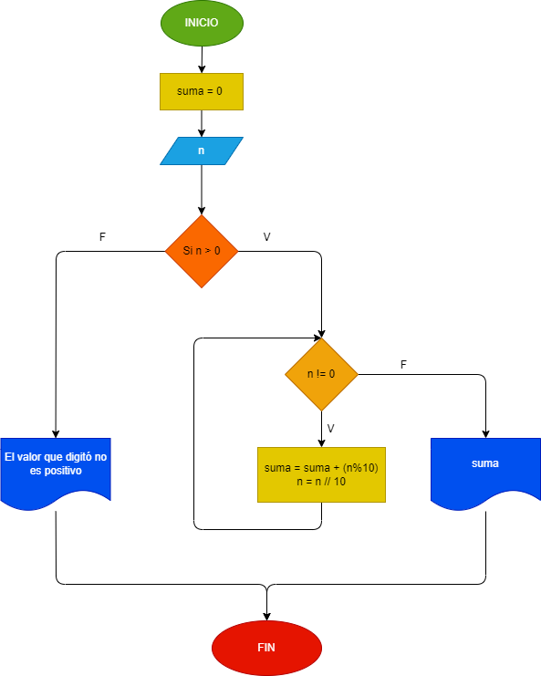

# Ejercicio 1
## Hacer el diagrama de flujo y el programa en python que lea un numero n, entero y positivo, de cualquier numero de digitos, que calcule la suma de sus digitos y que la imprima con el numero leido

