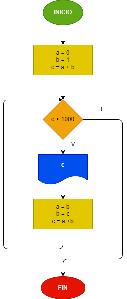

# EJERCICIO 3
## La serie fibonnachi es una secuencia numerica, en la cual cada elemento es igual a la suma de los dos anteriores. Tomando como variables iniciales los dos primeros elementos A= 0 y B = 1, hacer el diagrama de flujo y el programa en python, que calcule e imprima a partir del tercero, todos los elementos de la serie fibonnacci que sean menores que 1000.
